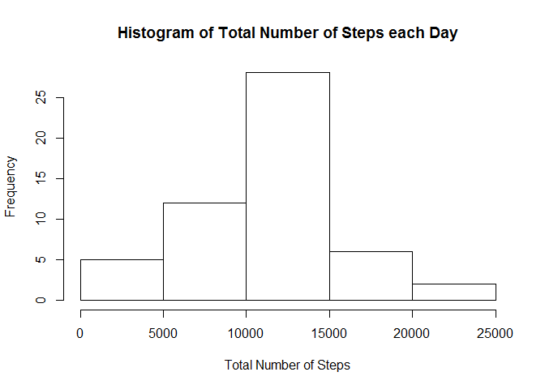
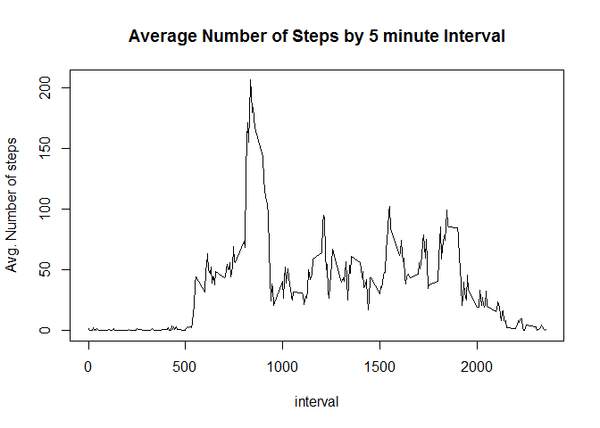
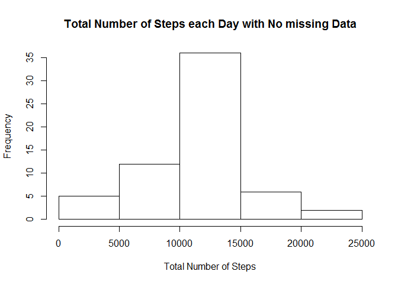
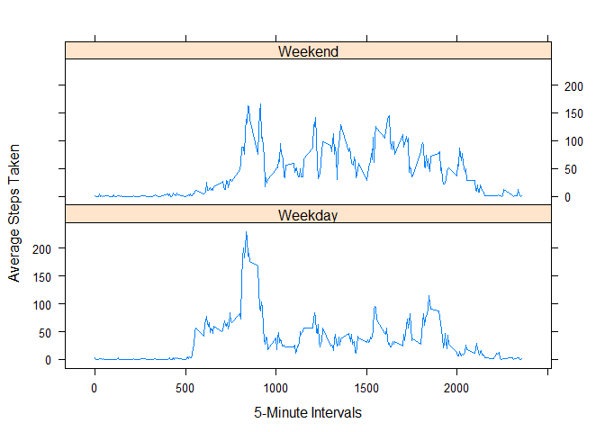

# Reproducible Research: Peer Assessment 1
Shibashis Mukherjee  


## Loading and preprocessing the data
###Set file path, load libraries and download file into project directory

```r
filesPath <- "C:/RData/RepData_PeerAssessment1"
setwd(filesPath)
library(lattice)
fileUrl <- "https://d396qusza40orc.cloudfront.net/repdata%2Fdata%2Factivity.zip"
download.file(fileUrl,destfile="./activitydata.zip")
```

###Unzip DataSet

```r
unzip(zipfile="./activitydata.zip")
activity <- read.csv("activity.csv",sep = ',', header = TRUE)
```

###Inspect the data 

```r
str(activity)
```

```
## 'data.frame':	17568 obs. of  3 variables:
##  $ steps   : int  NA NA NA NA NA NA NA NA NA NA ...
##  $ date    : Factor w/ 61 levels "2012-10-01","2012-10-02",..: 1 1 1 1 1 1 1 1 1 1 ...
##  $ interval: int  0 5 10 15 20 25 30 35 40 45 ...
```

```r
summary(activity)
```

```
##      steps                date          interval     
##  Min.   :  0.00   2012-10-01:  288   Min.   :   0.0  
##  1st Qu.:  0.00   2012-10-02:  288   1st Qu.: 588.8  
##  Median :  0.00   2012-10-03:  288   Median :1177.5  
##  Mean   : 37.38   2012-10-04:  288   Mean   :1177.5  
##  3rd Qu.: 12.00   2012-10-05:  288   3rd Qu.:1766.2  
##  Max.   :806.00   2012-10-06:  288   Max.   :2355.0  
##  NA's   :2304     (Other)   :15840
```

## What is mean total number of steps taken per day?
#### For this part of the assignment, the missing values are ignored.

### Calculate the total number of steps taken per day

```r
stepsbydate <- aggregate(steps ~ date, data=activity, FUN = sum, na.rm=TRUE)
```

### Plot a histogram for total number of steps taken each day


```r
hist(stepsbydate$steps, main="Histogram of Total Number of Steps each Day", xlab = "Total Number of Steps")
```



### The mean total number of steps taken per day is shown below.

```r
mean(stepsbydate$steps)
```

```
## [1] 10766.19
```

### The median of number of steps taken per day is shown below.

```r
median(stepsbydate$steps)
```

```
## [1] 10765
```

## What is the average daily activity pattern?
#### The average daily activity pattern is shown by making a time series plot (i.e. type = "l") of the 5-minute interval (x-axis) and the average number of steps taken, averaged across all days (y-axis).

### Calculate the average number of steps taken in each 5 minute interval

```r
activitybyinterval <- aggregate(steps ~ interval, data=activity, FUN=mean)
```

### Create the time series plot

```r
plot(activitybyinterval, type = "l", main = "Average Number of Steps by 5 minute Interval", ylab = "Avg. Number of steps")
```



###  The 5-minute interval, on average across all the days in the dataset, that contains the maximum number of steps is calculated below.

```r
activitybyinterval$interval[which.max(activitybyinterval$steps)]
```

```
## [1] 835
```

## Imputing missing values
#### There are a number of days/intervals where there are missing values (coded as NA). The following fills the NA values using a strategy.

### Calculate and report the total number of missing values in the dataset (i.e. the total number of rows with NAs)

```r
sum(is.na(activity))
```

```
## [1] 2304
```

### Devise a strategy for filling in all of the missing values in the dataset. The strategy does not need to be sophisticated. For example, you could use the mean/median for that day, or the mean for that 5-minute interval, etc. 

#### The chosen strategy uses the mean for that 5 minute interval to fill an NA value.

### Create a new dataset that is equal to the original dataset but with the missing data filled in.

```r
activityimputed <- activity
activitymean <- aggregate(steps ~ interval, data=activity, FUN=mean)
a <- c()
for (i in 1:nrow(activityimputed)) {
  if (is.na(activityimputed[i,"steps"])) {
    temp <- activityimputed[i,"interval"]
    activityimputed[i, "steps"] <- subset(activitymean, interval == temp)$steps
  }
}
```


### Make a histogram of the total number of steps taken each day. 

```r
dailysteps <- aggregate(steps ~ date, data=activityimputed, FUN=sum)
hist(dailysteps$steps, main="Total Number of Steps each Day with No missing Data", xlab = "Total Number of Steps")
```



### Calculate and report the mean and median total number of steps taken per day for data with NA and imputed data. 

```r
### mean and median for imputed data
mean(dailysteps$steps)
```

```
## [1] 10766.19
```

```r
median(dailysteps$steps)
```

```
## [1] 10766.19
```

```r
### mean and median for original data
mean(stepsbydate$steps)
```

```
## [1] 10766.19
```

```r
median(stepsbydate$steps)
```

```
## [1] 10765
```

### Do these values differ from the estimates from the first part of the assignment? 
#### The mean value for imputed data is the same while the median is slightly different. The total number of days with average number of steps increases in the imputed data since we set the missing values to the mean for that interval.

### What is the impact of imputing missing data on the estimates of the total daily number of steps?
#### Imputing data seems to have changed the median of the distribution and the mean and the median values of the imputed data are same.

## Are there differences in activity patterns between weekdays and weekends?

### Create a new factor variable in the dataset with two levels - "weekday" and "weekend" indicating whether a given date is a weekday or weekend day.

```r
activityimputed$day <- weekdays(as.Date(activityimputed$date))
daytype <- vector()
for (i in 1:nrow(activityimputed)) {
  if (activityimputed$day[i] == "Saturday") {
    daytype[i] <- "Weekend"
  } else if (activityimputed$day[i] == "Sunday") {
    daytype[i] <- "Weekend"
  } else {
    daytype[i] <- "Weekday"
  }
}
activityimputed$daytype <- daytype
activityimputed$daytype <- factor(activityimputed$daytype)

stepsperday <- aggregate(steps ~ interval + daytype, data = activityimputed, mean)
names(stepsperday) <- c("interval", "daytype", "steps")
```

### Make a panel plot containing a time series plot (i.e. type = "l") of the 5-minute interval (x-axis) and the average number of steps taken, averaged across all weekday days or weekend days (y-axis).

```r
xyplot(steps ~ interval | factor(daytype),
       data=stepsperday,
       type = 'l',
       layout = c(1, 2),
       xlab="5-Minute Intervals",
       ylab="Average Steps Taken")
```



#### Average number of steps during 5 minute intervals in the weekends is higher than the average number of steps during 5 minute intervals on the weekdays. 
